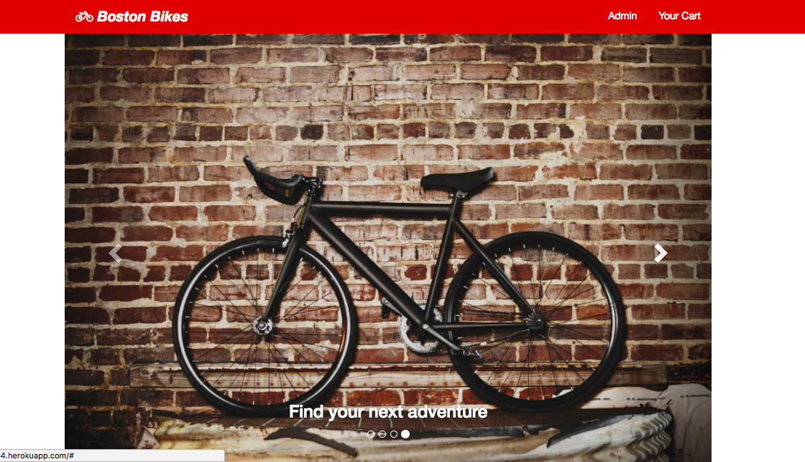
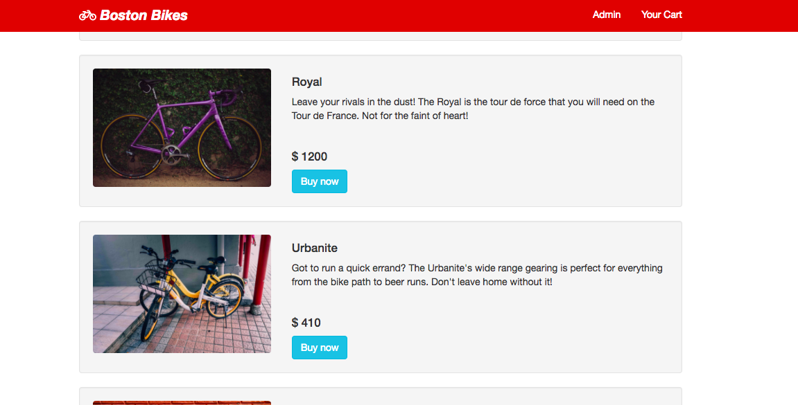
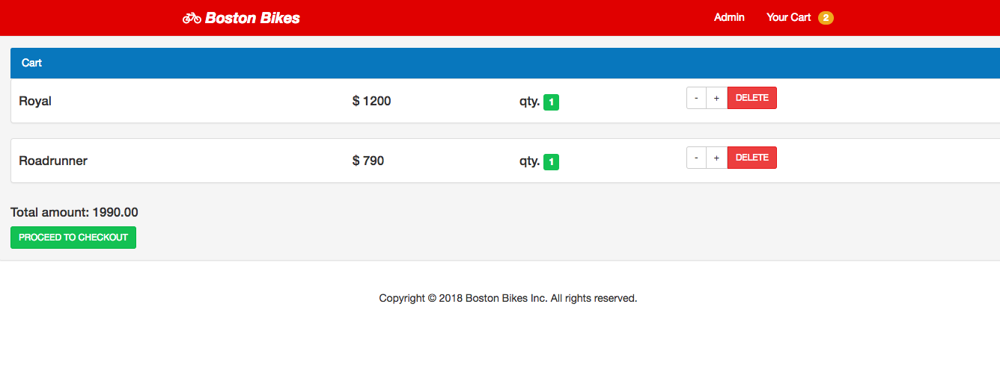
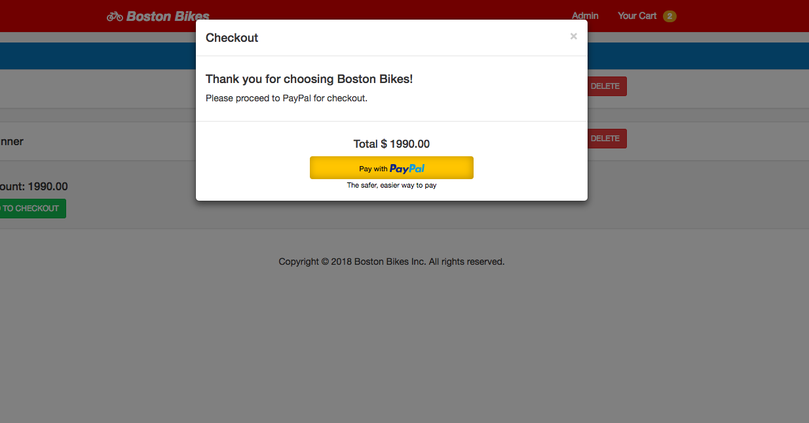
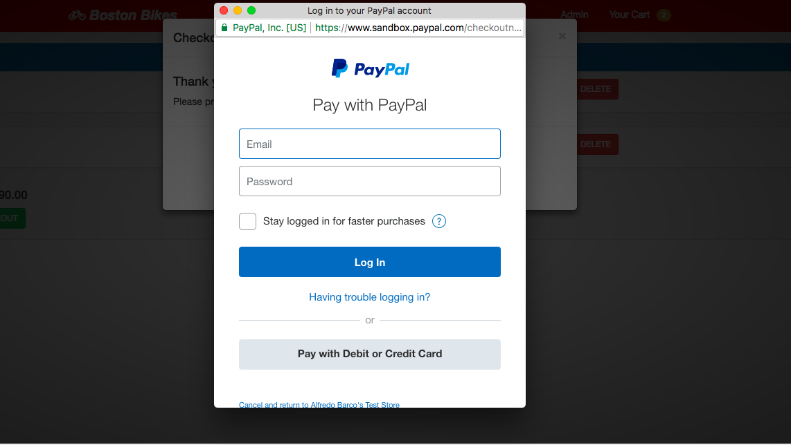

# Boston Bikes

Boston Bikes provides users with a seamless shopping experience and easy PayPal transactions. 



## Live Demo

App deployed on Heroku at: https://desolate-sea-18254.herokuapp.com/



## Built With

* [React](https://reactjs.org/) - Javascript library for building UI's  
* [Redux](https://redux.js.org/) - state container for JavaScript apps
* [React-Bootstrap](https://react-bootstrap.github.io/) - front-end framework for React
* [Babel](https://babeljs.io/) - Javascript Transpiler
* [Node JS](https://nodejs.org/en/) - server-side scripting 
* [Express](https://expressjs.com/) - web application framework for Node.js
* [MongoDB](https://www.mongodb.com/) - back-end database used


## Usage 

After browsing our current inventory, select the items you would to purchase. Then click on "Your Cart" in the header to review the items in your shopping cart.



Next click on "Proceed to Checkout" to bring up the modal window indicating that you will be leaving the site temporarily to checkout via PayPal Express Checkout. 



Clicking the yellow "Pay with PayPal" button begins the secured payment authorization process.




## Contributing

If you think you found a bug, please submit a new issue in the [issue tracker](https://github.com/betukay/react-cart-app/issues). Try to be as detailed as possible so we can improve your user experience. 

If you are interested in contributing new features to Boston Bikes, feel free to [submit a Pull Request](https://help.github.com/articles/about-pull-requests/).

## License

```Groovy
MIT License

Copyright (c) 2018 Betu Kayembe

Permission is hereby granted, free of charge, to any person obtaining a copy
of this software and associated documentation files (the "Software"), to deal
in the Software without restriction, including without limitation the rights
to use, copy, modify, merge, publish, distribute, sublicense, and/or sell
copies of the Software, and to permit persons to whom the Software is
furnished to do so, subject to the following conditions:

The above copyright notice and this permission notice shall be included in all
copies or substantial portions of the Software.

THE SOFTWARE IS PROVIDED "AS IS", WITHOUT WARRANTY OF ANY KIND, EXPRESS OR
IMPLIED, INCLUDING BUT NOT LIMITED TO THE WARRANTIES OF MERCHANTABILITY,
FITNESS FOR A PARTICULAR PURPOSE AND NONINFRINGEMENT. IN NO EVENT SHALL THE
AUTHORS OR COPYRIGHT HOLDERS BE LIABLE FOR ANY CLAIM, DAMAGES OR OTHER
LIABILITY, WHETHER IN AN ACTION OF CONTRACT, TORT OR OTHERWISE, ARISING FROM,
OUT OF OR IN CONNECTION WITH THE SOFTWARE OR THE USE OR OTHER DEALINGS IN THE
SOFTWARE.
```
